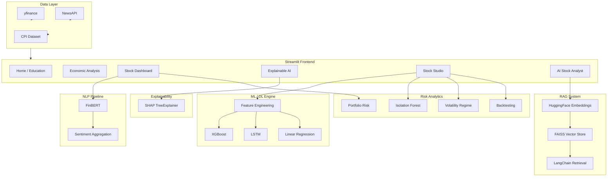
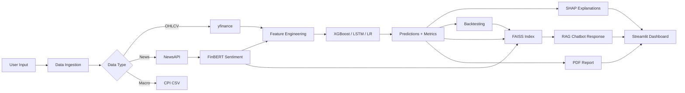

# InvestAI — AI-Powered Stock Market Prediction, Analysis and Decision Support System

**Final Year Computer Engineering / Information Technology Project**

A research-oriented intelligent investment decision support platform combining Machine Learning, Deep Learning, Financial Sentiment Analysis, Explainable AI, Portfolio Risk Analytics, Time Series Forecasting, RAG, and Interactive Visualization.

---

## Quick Start

```bash
cd stock_ai_project
python -m venv .venv
.venv\Scripts\activate        # Windows
pip install -r requirements.txt
streamlit run app.py
```

Open `http://localhost:8501` in your browser.

### Environment Variables (Optional)

| Variable | Purpose |
|----------|---------|
| `NEWS_API_KEY` | NewsAPI key for live financial news |
| `OPENAI_API_KEY` | Optional — for future LLM integration |

---

## Project Structure

```
stock_ai_project/
├── app.py                      # Main Streamlit application
├── pages/
│   ├── page_home.py            # Home / Education
│   ├── page_inflation.py       # Economic Analysis (CPI)
│   ├── page_dashboard.py       # Stock Dashboard + FinBERT
│   ├── page_xai.py             # Explainable AI & Model Analytics
│   ├── page_studio.py          # Stock Studio (Prediction Engine)
│   └── page_chatbot.py         # AI Stock Analyst (RAG)
├── models/
│   ├── xgboost_model.py        # XGBoost prediction engine
│   ├── lstm_model.py           # LSTM deep learning model
│   ├── explainability.py       # SHAP explainability
│   ├── anomaly_detection.py    # Isolation Forest anomalies
│   └── sentiment_model.py      # FinBERT sentiment engine
├── chatbot/
│   ├── rag_engine.py           # LangChain RAG orchestration
│   ├── vector_store.py         # FAISS vector database
│   └── prompts.py              # Prompt templates
├── utils/
│   ├── config.py               # Configuration constants
│   ├── data_loader.py          # yfinance & news data loading
│   ├── feature_engineering.py  # ML feature pipeline
│   ├── metrics.py              # RMSE, MAE, MAPE, R², Directional Accuracy
│   ├── model_comparison.py     # 3-model comparison framework
│   ├── backtesting.py          # Sharpe, Sortino, CAGR, drawdown
│   ├── portfolio_risk.py       # Portfolio analytics
│   ├── volatility_regime.py    # Volatility classification
│   ├── pdf_report.py           # ReportLab PDF generation
│   └── ui_helpers.py           # Streamlit UI utilities
├── data/                       # CPI dataset
├── reports/                    # Generated PDF reports
├── docs/                       # Academic documentation
└── requirements.txt
```

---

## System Architecture



---

## Data Flow Diagram



---

## Module Descriptions

| Module | Description |
|--------|-------------|
| `xgboost_model.py` | Trains XGBoost on engineered features; produces 1/7/30-day forecasts with confidence intervals |
| `lstm_model.py` | Sequence-based LSTM using TensorFlow/Keras for deep learning comparison |
| `sentiment_model.py` | FinBERT (ProsusAI/finbert) for finance-specific sentiment with keyword fallback |
| `explainability.py` | SHAP summary, importance, and waterfall plots with human-readable explanations |
| `anomaly_detection.py` | Isolation Forest detecting crashes, volume spikes, unusual patterns |
| `rag_engine.py` | Builds FAISS index from news, sentiment, predictions, risk; answers via retrieval |
| `feature_engineering.py` | Price, lag, rolling, RSI, MACD, Bollinger, volatility features |
| `model_comparison.py` | Trains all 3 models on identical splits; ranks by composite score |
| `backtesting.py` | Sharpe, Sortino, max drawdown, win rate, CAGR, risk recommendation |
| `portfolio_risk.py` | Multi-stock correlation, diversification score, risk-return scatter |
| `pdf_report.py` | Professional ReportLab PDF with all analysis sections |

---

## Feature Documentation

### Core Feature 1 — Advanced Stock Prediction Engine
- XGBoost with 18+ engineered features
- 1-day, 7-day, 30-day predictions with 95% confidence intervals

### Core Feature 2 — Model Comparison Framework
- XGBoost vs LSTM vs Linear Regression
- Metrics: RMSE, MAE, MAPE, R², Directional Accuracy
- Automatic best-model highlighting

### Core Feature 3 — Explainable AI Dashboard
- SHAP summary, importance, waterfall plots
- Human-readable prediction explanations

### Core Feature 4 — Backtesting & Strategy Evaluation
- Sharpe, Sortino, max drawdown, win rate, CAGR
- Equity curve and drawdown charts
- Low/Medium/High risk recommendation

### Core Feature 5 — FinBERT Sentiment Engine
- Replaces TextBlob entirely
- Sentiment trend dashboard with market mood indicator

### Core Feature 6 — Research Contribution
- Model A (price only) vs Model B (price + sentiment)
- Quantified accuracy improvement percentage

### Core Feature 7 — Anomaly Detection
- Isolation Forest with Normal/Warning/Anomaly badges

### Core Feature 8 — Volatility Regime Detection
- Low/Medium/High volatility with color-coded indicators

### Core Feature 9 — Portfolio Risk Dashboard
- 3–5 stock selection, correlation heatmap, diversification score

### Core Feature 10 — PDF Report Generation
- Downloadable professional analysis report

### Core Feature 11 — AI Stock Analyst (RAG)
- FAISS + LangChain retrieval from news, sentiment, predictions, risk

### Core Feature 12 — Dashboard Enhancements
- 60-second auto-refresh, multi-stock comparison, confidence bands, dark/light theme

---

## Project Workflow

1. **Data Collection** — Fetch OHLCV via yfinance, news via NewsAPI, CPI from local dataset
2. **Feature Engineering** — Generate lag, rolling, technical, and sentiment features
3. **Model Training** — Train XGBoost, LSTM, Linear Regression on chronological splits
4. **Evaluation** — Compare models using RMSE, MAE, MAPE, R², directional accuracy
5. **Explainability** — SHAP analysis for global and local feature importance
6. **Sentiment Analysis** — FinBERT classification of news articles
7. **Research Study** — Compare price-only vs price+sentiment XGBoost models
8. **Risk Analytics** — Anomaly detection, volatility regime, portfolio analysis
9. **RAG Indexing** — Embed and store intelligence in FAISS vector database
10. **Reporting** — Generate PDF reports and display interactive dashboards

---

## Research Contribution

This project demonstrates that incorporating **FinBERT financial sentiment** as an additional feature in XGBoost can improve stock price prediction accuracy compared to price-only models.

**Methodology:**
- Model A: XGBoost trained on OHLCV + technical indicators only
- Model B: XGBoost trained on same features + aggregated FinBERT sentiment score
- Comparison on identical train/test chronological splits
- Metrics: RMSE, MAE, Directional Accuracy

Results are displayed on the **Explainable AI** page with the message:
*"Sentiment improved prediction accuracy by X% (RMSE reduction)."*

---

## Future Scope

- Real-time WebSocket market data feeds (NSE/BSE)
- Reinforcement learning for portfolio optimization
- Transformer-based time series models (Temporal Fusion Transformer)
- Multi-modal analysis (earnings call transcripts, SEC filings)
- Cloud deployment with Docker + Kubernetes
- Mobile application with push notifications
- Integration with broker APIs for paper trading

---

## Viva Questions & Answers

**Q1: Why XGBoost over Linear Regression?**
A: Stock prices exhibit non-linear patterns. XGBoost captures complex feature interactions (RSI × Volume × Sentiment) that linear models cannot.

**Q2: What is FinBERT and why not TextBlob?**
A: FinBERT is pre-trained on financial text. It understands domain terms like "beat earnings" or "guidance cut" better than general-purpose TextBlob.

**Q3: Explain SHAP in simple terms.**
A: SHAP shows which features pushed the prediction up or down, like explaining a credit score — each feature gets a contribution value.

**Q4: How does the RAG chatbot work?**
A: It indexes financial documents (news, predictions, risk metrics) in FAISS, retrieves relevant context for the user's question, and generates a structured answer from that evidence.

**Q5: What is Isolation Forest?**
A: An unsupervised algorithm that isolates anomalous data points. It detects unusual price/volume patterns without needing labeled crash data.

**Q6: Why chronological train/test split?**
A: Stock data is time-series. Random splits cause data leakage — the model would "see the future." Chronological splits simulate real trading conditions.

**Q7: What is the Sharpe Ratio?**
A: Risk-adjusted return metric. Higher Sharpe means better returns per unit of risk taken. Above 1.0 is generally considered good.

**Q8: How do confidence intervals work in predictions?**
A: Based on model residual standard deviation, we compute ±1.96σ bands representing the 95% confidence range for the forecast.

---

## Deployment Guide

### Local Deployment
```bash
streamlit run app.py
```

### Production (Streamlit Cloud)
1. Push to GitHub repository
2. Connect at [share.streamlit.io](https://share.streamlit.io)
3. Set `NEWS_API_KEY` in Streamlit secrets
4. Main file: `app.py`

### Docker Deployment
```dockerfile
FROM python:3.11-slim
WORKDIR /app
COPY requirements.txt .
RUN pip install -r requirements.txt
COPY . .
EXPOSE 8501
CMD ["streamlit", "run", "app.py", "--server.address", "0.0.0.0"]
```

```bash
docker build -t investai .
docker run -p 8501:8501 -e NEWS_API_KEY=your_key investai
```

---

## Disclaimer

This project is developed for **academic and educational purposes only**. It does not constitute financial advice. Always consult qualified financial advisors before making investment decisions.

---

## Authors

Final Year Computer Engineering / IT Project — InvestAI Platform
